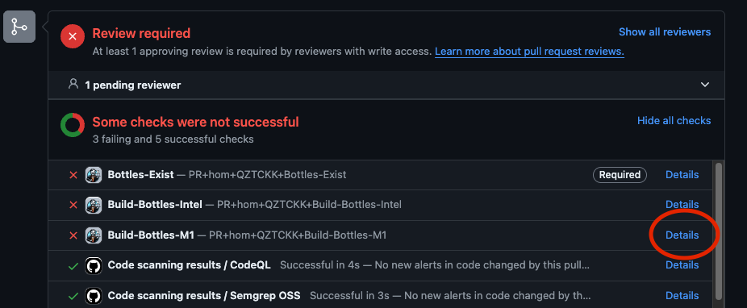
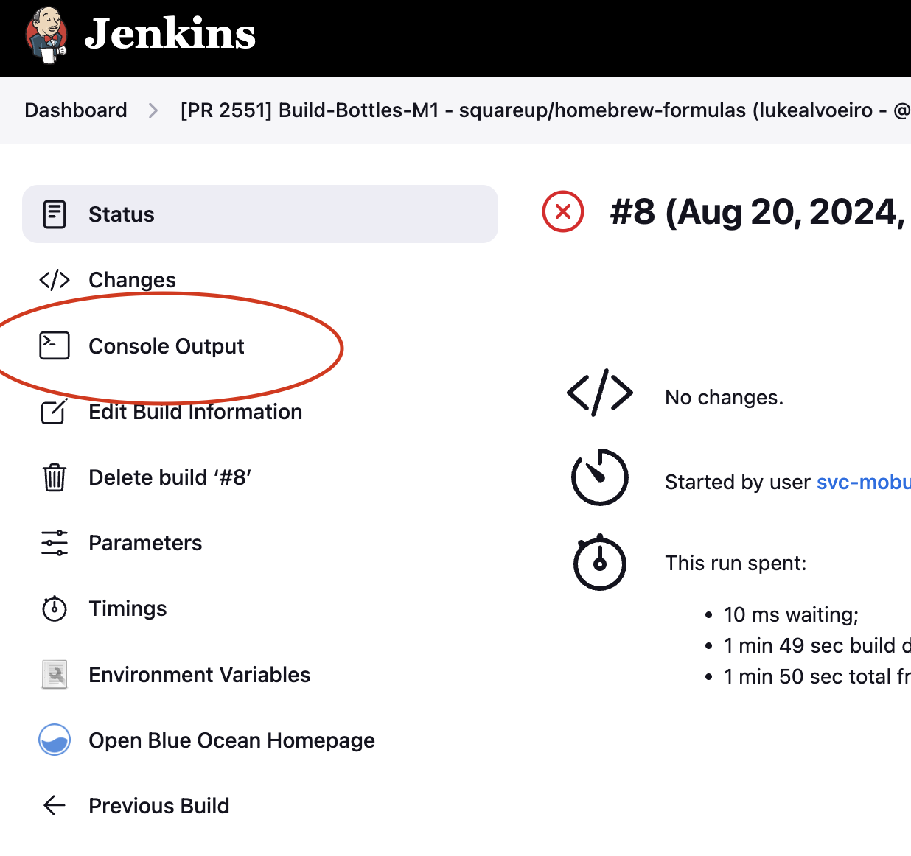

# Releases

## How to get the latest versions

Folks can run `sq update`, which will update their version of `sq goose`.

## Terminology

- Mobuild: the CI system for `homebrew-formulas`. If you don't have access, apply on behalf of your team for the [mobuild-jenkins-eng][mobuild-registry-role] role

## Releasing a new version

In order to release a new version of `sq goose`, you need to do the following:

1. If you have any changes in `exchange`, bump the version of `exchange`'s `pyproject.toml`, create a PR with those changes, and merge it into `main`.
2. If you have any changes in `goose` (or you completed step 1 above), bump the version of `goose`'s `pyproject.toml`, create a PR with those changes, and merge them into `main`.
3. Update `goose-plugins-block` to include the latest versions of `exchange` and `goose`. Steps:
   1. Run `poetry install --sync` to ensure you have a clean installation of `goose-plugins-block`
   2. Update the version values in the `pyproject.toml`
   3. Run `poetry update` to update to the latest versions of these dependencies.
4. Run `just brew-requirements` to update the `.brew-requirements.txt` file to the latest version.
5. Create a PR with all these changes, merge it into `main`
6. Once this PR has been merged in, run:
   1. `git checkout main && git fetch && git pull` to ensure you are fully caught up with `main`
   2. Create a new Github tag for the release via `git tag "<new_version>"`. The new version should match something like `"0.1.2"` and should NOT be precedeed by a `v`.
   3. Push this new tag via `git push --tags`
7. (This step will soon be automated) Publish a new homebrew formula for goose. In order to do so:
   1. Cut a new branch of `squareup/homebrew-formulas`
   2. Bump the [version of `block-goose.rb`][block-goose-version] to the new version.
   3. Create a PR with these changes
   4. The bottle builder on Mobuild will automatically create bottles for this release. Just wait until CI goes green and then merge your PR.

### Debugging Issues with Mobuild

### Debugging locally

You can test your to `homebrew-formulas` before merging the pull request with:

```bash
git -C $(brew --repo square/formula) fetch
git -C $(brew --repo square/formula) checkout origin/bump-ski-cli-to-2.16.5
git -C $(brew --repo square/formula) pull

brew install square/formula/block-goose
```

Followed by regular testing with `sq goose`

When you're done testing, reset the tap with:

```bash
git -C $(brew --repo square/formula) checkout master
```

## Debugging CI

If you notice the bottles are failing to build, click on the "Details" button. If you don't have access to this, then please apply for the [mobuild-registry-role] role on behalf of your team.



Then click on the following to access the logs



[block-goose-version]: https://github.com/squareup/homebrew-formulas/blob/98918a6915bfcbeee305b996cf965da40202d02a/block-goose.rb#L12
[mobuild-registry-role]: https://registry.sqprod.co/groups/mobuild-jenkins-eng
